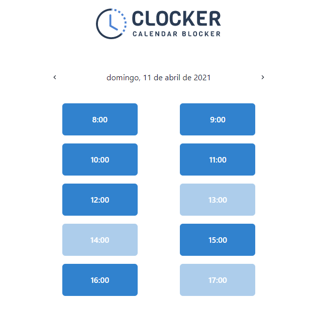

  

<h3 align="center">
  Project based on <a href="https://www.youtube.com/c/CodarMe/videos">CodarMe Videos</a>
</h3>
 

  
  
  
  
   
   
  <a href="#space_invader-technologies">Technologies</a>
   
   
  
   
  
   
  <h3 align="center">
    <a href="https://clocker-codarme.vercel.app/login" target="_blank">
      <b>VISIT</b>
    </a>
  </h3>

## :space_invader: Technologies

- [NextJS](https://nextjs.org/)
- Typescript
- [Chakra UI](https://chakra-ui.com/)
- [Firebase](https://firebase.google.com/?hl=pt-br)
- [Formik](https://formik.org/)
- [Yup](https://github.com/jquense/yup)
